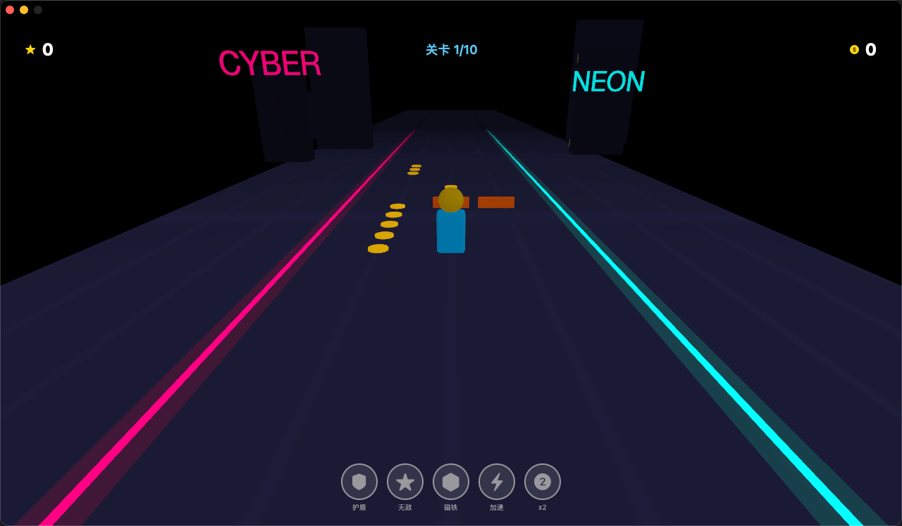

# Neon Rush

Extreme Parkour Game for macOS

**English** | [中文](README.zh-CN.md)

## Overview

Neon Rush is a 3D endless-runner style game built with SwiftUI + SceneKit on macOS.
You run through a neon cyberpunk track, dodge obstacles, collect coins, and use power-ups to survive longer and score higher.

## Gameplay Screenshot



## Features

- 3-lane movement system
- Jump and dodge mechanics
- Obstacles, coins, and random power-ups
- Pause/resume flow
- Level progression and score system

## Controls

- `A / D` or `← / →`: move left/right
- `Space`: jump
- `P`: pause/resume

## Run Locally

### Option 1: Open in Xcode

1. Open `/Users/yangsonhung/Projects/personal/run-3d/run-3d.xcodeproj`
2. Select scheme `run-3d`
3. Run the app (`Cmd + R`)

### Option 2: Build via command line

```bash
xcodebuild -project run-3d.xcodeproj -scheme run-3d -configuration Debug -derivedDataPath build build
```

### Optional: Regenerate Xcode project

```bash
xcodegen generate
```

## Project Structure

- `run-3d/` - Swift source files (App, Views, GameLogic, Models, SceneKit)
- `run-3d.xcodeproj/` - Xcode project
- `project.yml` - XcodeGen configuration
- `view.png` - gameplay screenshot used in README

## License

This project is licensed under the [MIT License](LICENSE).
